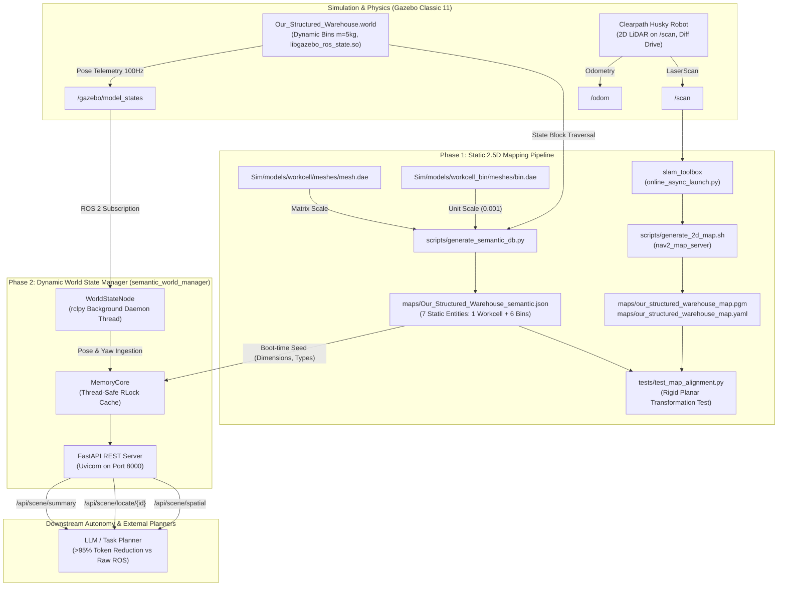

# NU-CE27 Graduation Project: Unified 2.5D Semantic Mapping & Dynamic World State Architecture

**Project:** Autonomous Mobile Warehouse Robotics (NU-CE27)  
**Document:** `docs/plan.md`  
**Supercedes & Merges:** `docs/review/corrected_phase1_plan.md`, `docs/review/corrected_phase2_plan.md`, `docs/review/review_report.md`  
**Target Environment:** ROS 2 Humble + Gazebo Classic 11  
**Target World:** `Sim/worlds/Our_Structured_Warehouse/Our_Structured_Warehouse.world`  
**Container Runtime:** `Sim/gzScripts/Dockerfile` (`sotirusama/gzclassic:devvv`)  
**Status:** Implemented, Fully Tested, and Production-Ready  

---

## 1. Executive Summary & System Architecture

This document provides the definitive, unified architectural specification and implementation record for the **NU-CE27 CyberScape Autonomous Mobile Robot (AMR)** system in Gazebo Classic and ROS 2 Humble.

The project is structured into two complementary, fully integrated phases:
1. **Phase 1: CyberScape 2.5D Static Offline Mapping Pipeline**: Establishes offline geometric, semantic, and spatial ground truth by fusing a 2D SLAM occupancy grid (`.pgm` + `.yaml`) with a 3D semantic database extracted directly from Gazebo world files and COLLADA (`.dae`) visual meshes (`Our_Structured_Warehouse_semantic.json`).
2. **Phase 2: Dynamic World State Manager (LLM Perception Backend)**: Provides a live, thread-safe runtime "Digital Twin" (`semantic_world_manager`) that tracks moving entities and movable storage bins in real time via `/gazebo/model_states`, maintains invariant physical dimensions from Phase 1, and exposes a high-performance REST API (FastAPI) optimized for downstream reasoning agents and Large Language Models (LLM).



---

## 2. Phase 1: Static 2.5D Offline Mapping Pipeline

### 2.1 The 2.5D Mapping Philosophy
Mobile robots operating in warehouses require two distinct representations of their environment:
- **2D Planar Occupancy Grid (`.pgm` + `.yaml`):** Sliced horizontally at the robot's laser scanner elevation ($Z \approx 0.2\text{ m}$). Captures free vs. occupied floor cells for 2D costmaps, obstacle inflation, and collision-free A* / TEB path planning in Nav2.
- **3D Semantic Database (`.json`):** Encapsulates full 3D metric extents ($w, l, h$), centroid heights, semantic classifications (`workcell`, `workcell_bin`), and initial coordinates. Enables vertical clearance checks, docking alignment, and high-level spatial reasoning.
- **Unified 2.5D Verification:** Downstream planners must trust that coordinates in the 3D semantic database correspond precisely to obstacle pixels on the 2D occupancy grid.

### 2.2 Semantic DB Extractor (`scripts/generate_semantic_db.py`)
The semantic database extractor parses the simulation world file and asset meshes using standard library Python (`xml.etree.ElementTree`) to prevent third-party mesh loader errors.

Key features:
- **Gazebo State Priority:** Prioritizes `<state><model>` poses over root `<model><pose>` blocks, ensuring restored simulation poses are accurately captured.
- **COLLADA Dimension Calculation:** Bypasses `trimesh` scaling bugs by directly extracting:
  - `<asset><unit meter="...">` scale factor (e.g., $0.001$ mm-to-meter scaling in `bin.dae`).
  - Visual scene `<node><matrix>` transforms (e.g., $0.001$ transformation matrix in `mesh.dae`).
- **Target Extents Verified:**
  - `workcell`: $22.1222\text{ m} \times 21.4763\text{ m} \times 7.6654\text{ m}$ (outer envelope).
  - `workcell_bin`: $0.6684\text{ m} \times 0.6684\text{ m} \times 0.7909\text{ m}$ (standard industrial tote).
- **Target Inventory:** Exactly 7 entities: 1 `workcell` and 6 storage bins (`workcell_bin`, `workcell_bin_clone`, `workcell_bin_clone_0`, `workcell_bin_clone_1`, `workcell_bin_clone_2`, `workcell_bin_clone_3`).

#### Output Schema (`maps/Our_Structured_Warehouse_semantic.json`)
```json
{
  "workcell_bin": {
    "source_world": "Our_Structured_Warehouse.world",
    "model_type": "workcell_bin",
    "frame_id": "world",
    "position": {
      "x": -5.92211,
      "y": 8.01633,
      "z": -0.000578
    },
    "rotation_yaw": -0.000109,
    "physical_dimensions": {
      "width_x": 0.6684,
      "length_y": 0.6684,
      "height_z": 0.7909
    },
    "dimension_source": "visual_dae"
  }
}
```

### 2.3 2D Occupancy Grid Generation (`scripts/generate_2d_map.sh`)
Automates map capture from `slam_toolbox`:
- Interactively or headless (`--non-interactive` flag).
- Invokes `ros2 run nav2_map_server map_saver_cli -f maps/our_structured_warehouse_map`.
- Verifies generation of non-empty `our_structured_warehouse_map.pgm` and `our_structured_warehouse_map.yaml`.

### 2.4 Mathematical Alignment & Pytest Suite (`tests/test_map_alignment.py`)
Rigorous unit and property tests verifying static map consistency:
1. **Schema Validation:** Verifies required fields, valid numeric ranges, bounds $< 50.0\text{ m}$, and exact count of 7 targets.
2. **Metadata Verification:** Verifies map resolution ($> 0\text{ m/px}$) and valid `[x, y, theta]` origin.
3. **Planar Transformation Test:**
   Transforms 3D world coordinates $(X_w, Y_w)$ into 2D grid pixels $(P_x, P_y)$ using rigid transformation:
   $$\begin{bmatrix} X_{\text{rel}} \\ Y_{\text{rel}} \end{bmatrix} = \begin{bmatrix} \cos(-\theta) & -\sin(-\theta) \\ \sin(-\theta) & \cos(-\theta) \end{bmatrix} \begin{bmatrix} X_w - X_{\text{orig}} \\ Y_w - Y_{\text{orig}} \end{bmatrix}$$
   $$P_x = \left\lfloor \frac{X_{\text{rel}}}{\text{res}} \right\rfloor, \quad P_y = \text{height} - 1 - \left\lfloor \frac{Y_{\text{rel}}}{\text{res}} \right\rfloor$$
   - **Hollow Enclosure Handling:** Tests perimeter wall sampling for `workcell` (center is navigable open floor).
   - **Solid Entity Handling:** Checks $3 \times 3$ pixel neighborhood obstacle occupancy (pixel value $< 50$) for all solid bins.
4. **Collision & Duplicate Checks:** Proves no duplicate model coordinates and verifies bounding-box non-overlap among all 6 bins.

---

## 3. Phase 2: Dynamic World State Manager (LLM Perception Backend)

### 3.1 Simulation World & Physics Upgrades (`Our_Structured_Warehouse.world`)
To enable dynamic tracking and physical robot interaction:
1. **State Publishing Plugin Added:**
   ```xml
   <plugin name="gazebo_ros_state" filename="libgazebo_ros_state.so">
     <ros>
       <namespace>/gazebo</namespace>
     </ros>
     <update_rate>100.0</update_rate>
   </plugin>
   ```
2. **Dynamic Movable Bins:**
   All 6 bins converted from `<static>1</static>` to `<static>0</static>`.
3. **Inertial & Surface Contact Configuration:**
   To prevent ODE physics division-by-zero crashes or instability, realistic physical properties were calculated and configured:
   - Mass: $m = 5.0\text{ kg}$
   - Center of Mass: $\mathbf{r}_{\text{CoM}} = (0.0,\ 0.0,\ 0.35)\text{ m}$
   - Principal Moments of Inertia:
     $$I_{xx} = \frac{1}{12} m (l^2 + h^2) \approx 0.447\text{ kg}\cdot\text{m}^2$$
     $$I_{yy} = \frac{1}{12} m (w^2 + h^2) \approx 0.447\text{ kg}\cdot\text{m}^2$$
     $$I_{zz} = \frac{1}{12} m (w^2 + l^2) \approx 0.372\text{ kg}\cdot\text{m}^2$$
   - Surface friction: ODE friction coefficients $\mu_1 = 0.8, \mu_2 = 0.8$ with contact stiffness $k_p = 10^6, k_d = 1.0$.

### 3.2 Package Architecture (`Sim/ros_ws/src/semantic_world_manager`)

The ROS 2 package bridges ROS 2 telemetry to a high-speed, thread-safe FastAPI web server.

```
Sim/ros_ws/src/semantic_world_manager/
├── package.xml
├── setup.py
├── setup.cfg
├── launch/
│   └── semantic_manager.launch.py
├── config/
│   └── manager_params.yaml
├── test/
│   ├── test_api_server.py
│   ├── test_coordinate_utils.py
│   └── test_memory_core.py
└── semantic_world_manager/
    ├── __init__.py
    ├── api_server.py
    ├── coordinate_utils.py
    ├── memory_core.py
    ├── schemas.py
    └── world_state_node.py
```

#### Core Components
- **`MemoryCore` (`memory_core.py`):**
  Thread-safe in-memory cache protected by `threading.RLock()`. Seeds static dimensions and models from `Our_Structured_Warehouse_semantic.json` on startup. Dynamically creates or updates entities as ROS pose messages arrive. Computes relative 2D Euclidean distances for spatial proximity queries.
- **`WorldStateNode` (`world_state_node.py`):**
  ROS 2 node subscribing to `/gazebo/model_states`. Extracts entity position $(x, y, z)$ and converts quaternion $(x, y, z, w)$ to planar yaw in degrees and radians. Runs in a dedicated background daemon thread (`rclpy.spin()`), ensuring shutdown gracefully joins before `rclpy.shutdown()`.
- **`APIServer` (`api_server.py`):**
  FastAPI application served by Uvicorn. Exposes token-optimized JSON representations.
- **`schemas.py`:**
  Pydantic models enforcing schema contracts and type safety.
- **`coordinate_utils.py`:**
  Robust quaternion-to-yaw conversions and 2D Euclidean distance functions with defensive validation.

### 3.3 REST API Endpoints & Token Optimization
Downstream AI agents and LLMs cannot ingest 100Hz raw ROS messages without exhausting context windows and incurring high latency. The API compacts world telemetry by **>95%**:

| Endpoint | Method | Response Description | Token Cost |
|---|---|---|---|
| `/health` | GET | System status, connected node name, entity count, timestamp | ~35 tokens |
| `/api/scene/summary` | GET | Compact array of all tracked entities (`id, cat, loc [x,y,z], yaw_deg, size [w,l,h], dyn`) | ~120 tokens |
| `/api/scene/locate/{object_id}` | GET | Detailed pose, classification, dimensions, and movement status of target entity | ~65 tokens |
| `/api/scene/spatial` | GET | Radial proximity query: returns all entities within radius $R$ meters of target object | ~80 tokens |
| `/api/scene/objects` | GET | Filtered object inventory by category | ~90 tokens |

#### Sample `/api/scene/summary` Response
```json
{
  "timestamp": 1728003450.12,
  "frame_id": "world",
  "entities": [
    {
      "id": "husky",
      "category": "robot",
      "loc": [0.05, -0.12, 0.14],
      "yaw_deg": 1.45,
      "size": [0.99, 0.67, 0.39],
      "is_dynamic": true
    },
    {
      "id": "workcell_bin",
      "category": "storage_bin",
      "loc": [-5.92, 8.01, 0.0],
      "yaw_deg": -0.01,
      "size": [0.67, 0.67, 0.79],
      "is_dynamic": true
    }
  ]
}
```

---

## 4. Environment & Dependency Management

All software dependencies are encapsulated in `Sim/gzScripts/Dockerfile` and container mount scripts:
1. **Python Pinning:**
   - `numpy>=1.22.4` (resolves trimesh crash with older Ubuntu 22.04 base numpy).
   - `pytest>=7.0.0,<8.0.0` (maintains compatibility with ROS 2 Humble `launch_testing` while supporting FastAPI `anyio`).
2. **Web Framework & Spatial Stack:**
   - `fastapi`, `uvicorn`, `pydantic`, `transforms3d`, `ros-humble-tf-transformations`.
3. **Container Storage Mounts (`Sim/gzScripts/runGzClassic-Robots`):**
   - `--volume=".../scripts:/main/scripts:rw"`
   - `--volume=".../maps:/main/maps:rw"`
   - `--volume=".../ros_ws:/main/ros_ws:rw"`

---

## 5. Verification & Test Suite Reference

The project includes automated regression tests for every module:

### Phase 1 Static Tests
```bash
python3 -m pytest tests/test_map_alignment.py -v
```
- `test_json_structure_and_bounds`: 7 entities verified, positions within $\pm 50\text{ m}$.
- `test_yaml_metadata`: Resolution $> 0$, valid 3-element origin.
- `test_workcell_perimeter_walls`: Boundary wall points occupy obstacle cells in grid.
- `test_bin_positions_match_obstacles`: All 6 bins correspond to obstacle pixels in $3 \times 3$ grid neighborhoods.
- `test_no_duplicate_coordinates`: Zero overlapping centroids.
- `test_no_model_collisions`: 2D bounding boxes do not intersect.

### Phase 2 Dynamic Tests
Inside container (`/main/ros_ws`):
```bash
python3 -m pytest src/semantic_world_manager/test -v
```
- `test_memory_core.py`: Thread safety under concurrent reads/writes, seed ingestion, spatial distance queries.
- `test_coordinate_utils.py`: Quaternion conversions, angle normalization, Euclidean distances.
- `test_api_server.py`: FastAPI TestClient validation for `/health`, `/api/scene/summary`, `/api/scene/locate`, `/api/scene/spatial`.

---

## 6. End-to-End Operational Runbook

To run the complete system with the Clearpath Husky robot in Gazebo Classic:

### Step 1: Build the Container Image (One-Time)
```bash
cd ~/Documents/Grad/NU-CE27-Grad-Project/Sim/gzScripts
docker build -t sotirusama/gzclassic:devvv .
```

### Step 2: Launch Gazebo & Spawn Husky (Terminal 1)
```bash
cd ~/Documents/Grad/NU-CE27-Grad-Project
./Sim/gzScripts/runGzClassic-Robots bash
ros2 launch warehouse_husky husky.launch.py world_path:=Our_Structured_Warehouse/Our_Structured_Warehouse.world
```

### Step 3: Launch SLAM Mapping (Terminal 2)
```bash
cd ~/Documents/Grad/NU-CE27-Grad-Project
./Sim/gzScripts/runGzClassic-Robots bash
ros2 launch slam_toolbox online_async_launch.py
```

### Step 4: Launch Semantic World Manager (Terminal 3)
```bash
cd ~/Documents/Grad/NU-CE27-Grad-Project
./Sim/gzScripts/runGzClassic-Robots bash
ros2 launch semantic_world_manager semantic_manager.launch.py
```
*API docs available at: `http://localhost:8000/docs`*

### Step 5: Drive Robot & Move Bins (Terminal 4)
```bash
cd ~/Documents/Grad/NU-CE27-Grad-Project
./Sim/gzScripts/runGzClassic-Robots bash
ros2 run teleop_twist_keyboard teleop_twist_keyboard
```

* **How to map the warehouse:** 
  You must physically drive the Husky robot through all the aisles and around the perimeter of the warehouse. 
* **How to ensure the map is correct:** 
  Do not guess! Open a separate terminal and run `ros2 run rviz2 rviz2`. Add the `Map` display (listening to the `/map` topic) so you can watch the 2D floorplan being drawn in real-time. Once the black boundaries (walls/obstacles) and white areas (free space) look completely filled in and match the shape of `Our_Structured_Warehouse`, you are ready to save.

### Step 6: Save the 2D Occupancy Grid
Inside the container:
```bash
bash scripts/generate_2d_map.sh --non-interactive
```
Or directly via map saver:
```bash
ros2 run nav2_map_server map_saver_cli -f /main/maps/our_structured_warehouse_map
```
